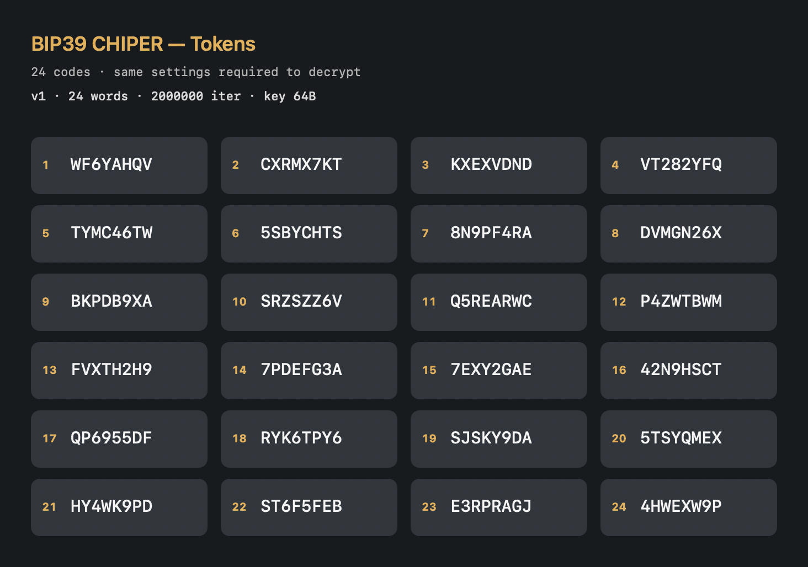
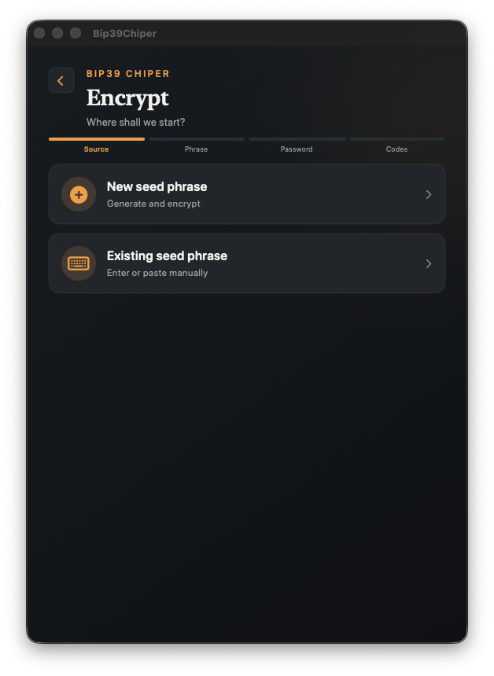
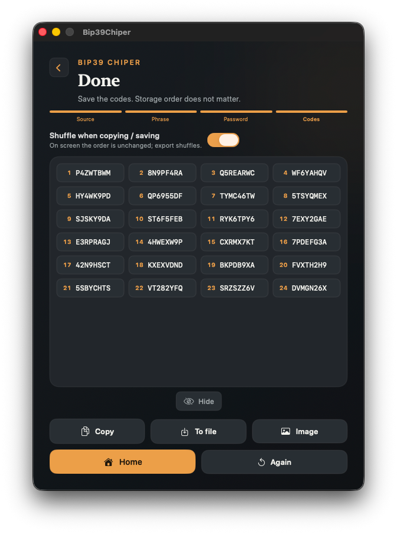
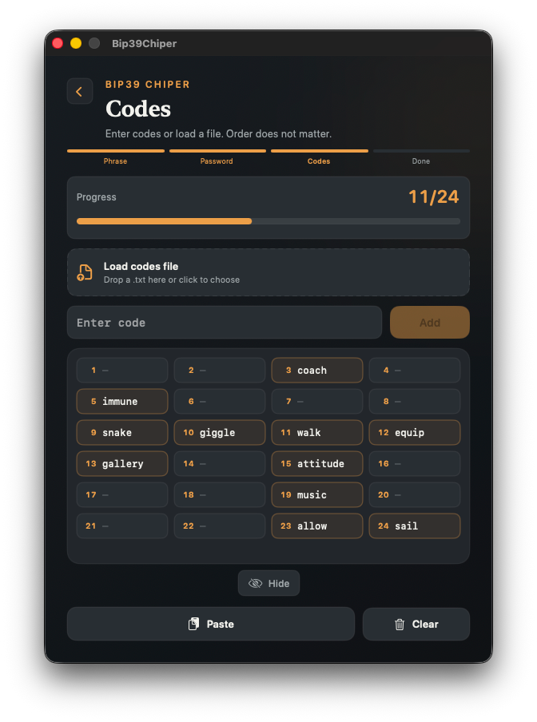
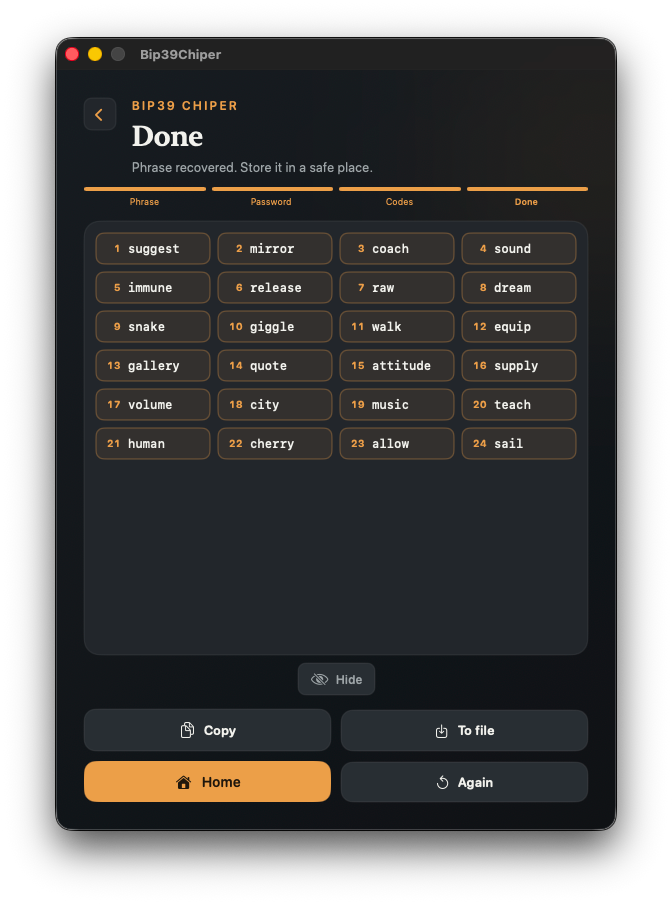
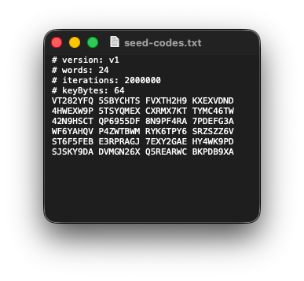
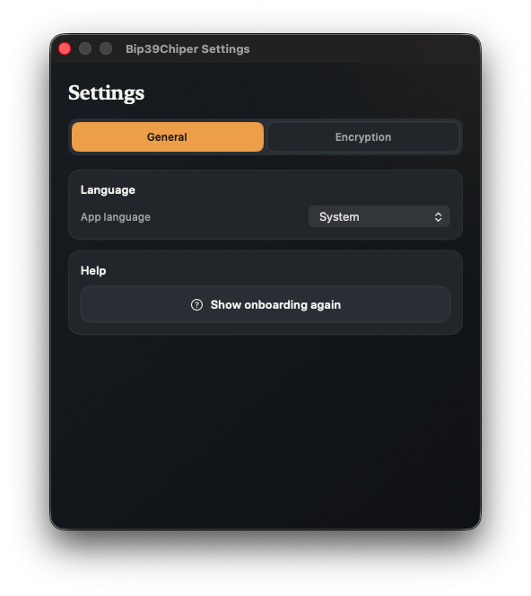
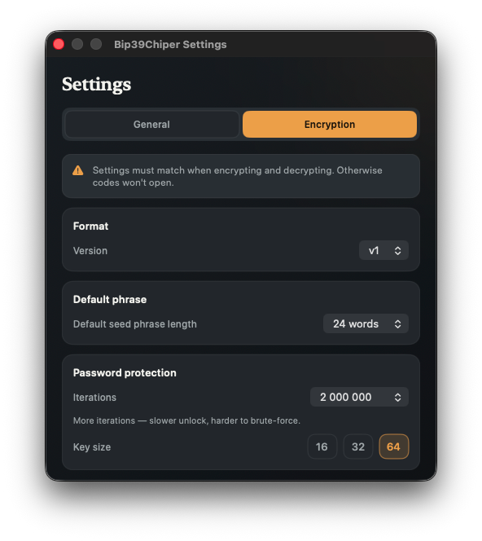

<p align="center">
  
</p>

<h1 align="center">Bip39Chiper</h1>

<p align="center">
  <strong>Offline macOS utility to obfuscate BIP-39 seed phrases</strong><br>
  Turn a mnemonic into unique codes — one per word slot.<br>
  Store them separately from your password; paste them back in <strong>any order</strong> to recover the phrase.<br>
  Everything runs offline on your Mac.
</p>

<p align="center">
  <a href="https://chiper.developer.pm/"></a>
  <a href="LICENSE"></a>
  
  
  
</p>

<p align="center">
  <a href="https://chiper.developer.pm/">Documentation</a> ·
  <a href="#install">Install</a> ·
  <a href="https://github.com/li-nd/bip39-chiper-mac/issues">Issues</a> ·
  <a href="#build">Build</a>
</p>

---

<p align="center">
  
</p>

## Features

| | |
|---|---|
| **Encrypt** | Create, enter, or generate a BIP-39 phrase → one code per word |
| **Decrypt** | Paste codes in **any order** · recover the mnemonic with your password |
| **Import / export** | `.txt` with embedded crypto settings · PNG poster · clipboard |
| **Configurable crypto** | PBKDF2 iterations · derived key length · default word count (12–24) |
| **Privacy** | Blur on background · clipboard auto-clear · optional shuffle on export |

## Install

```bash
brew tap li-nd/apps
brew trust li-nd/apps
brew install --cask bip39chiper
```

Tap: [li-nd/homebrew-apps](https://github.com/li-nd/homebrew-apps). Or download a zip from [Releases](https://github.com/li-nd/bip39-chiper-mac/releases). Full notes: **[Install guide](https://chiper.developer.pm/install/)**.

> Builds are **not notarized** (ad-hoc signed). If macOS blocks the app: **System Settings → Privacy & Security → Open Anyway**, or right-click → **Open**.

## Security note

Bip39Chiper is **obfuscation**, not encryption. It helps hide a seed phrase from casual observers when codes and password are stored separately. It is **not** a hardware wallet replacement. Read **[Security](https://chiper.developer.pm/security/)** before relying on it.

## Screenshots

### Encrypt & decrypt

Four wizard screens — same window size and aspect ratio.

<p align="center">
  
  &nbsp;
  
</p>
<p align="center">
  
  &nbsp;
  
</p>

### Export & settings

<p align="center">
  
</p>
<p align="center">
  
  &nbsp;
  
</p>

## Build

1. Clone **with submodules** (required for conformance tests):
   ```bash
   git clone --recurse-submodules https://github.com/li-nd/bip39-chiper-mac.git
   cd bip39-chiper-mac
   ```
   Already cloned? `git submodule update --init --recursive`.
2. Open `Bip39Chiper.xcodeproj` in Xcode.
3. Select the **Bip39Chiper** scheme and run (`⌘R`).

Test vectors live in [bip39-chiper-test-vectors](https://github.com/li-nd/bip39-chiper-test-vectors) (Git submodule). See **[Test vectors](https://chiper.developer.pm/test-vectors/)** for updating, running tests, and regenerating.

## Documentation

Published site: **[chiper.developer.pm](https://chiper.developer.pm/)**

| Page | Topic |
|------|--------|
| [Install](https://chiper.developer.pm/install/) | Homebrew, Releases, build from source |
| [Usage](https://chiper.developer.pm/usage/) | Encrypt/decrypt workflow with screenshots |
| [Security](https://chiper.developer.pm/security/) | Crypto overview and threat model |
| [Algorithm specification](https://chiper.developer.pm/algorithm-spec/) | Normative v1 scheme for independent implementations |
| [Test vectors](https://chiper.developer.pm/test-vectors/) | Submodule setup and conformance tests |
| [Troubleshooting](https://chiper.developer.pm/troubleshooting/) | Common issues |

### Preview docs locally

```bash
python3 -m venv .venv-docs
source .venv-docs/bin/activate
pip install -r requirements-docs.txt
mkdocs serve
```

Pages deploy from `main` via [`.github/workflows/docs.yml`](.github/workflows/docs.yml).

## License

[MIT](LICENSE) © [Markus Lind](https://github.com/li-nd)
