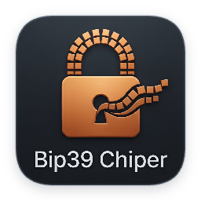
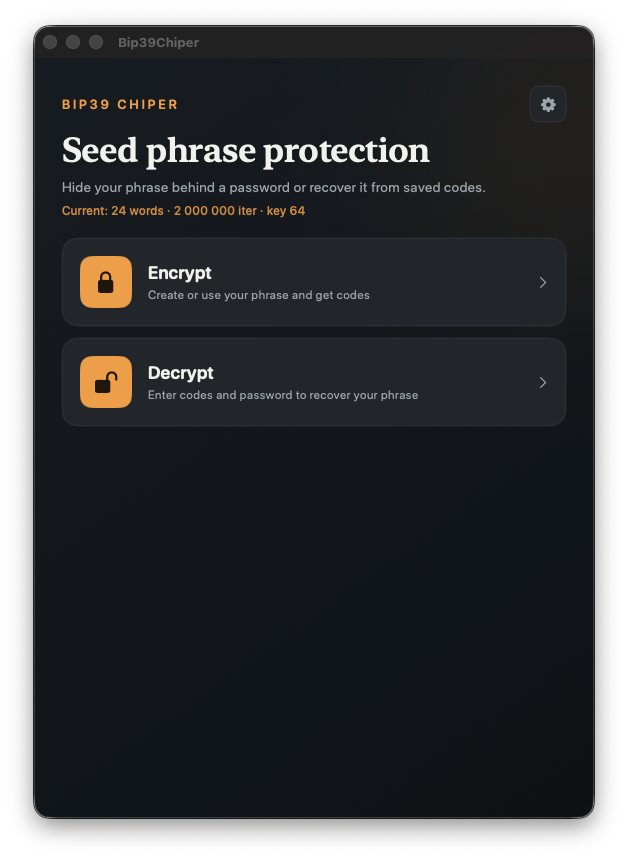

<div class="bc-hero" markdown="0">
  
</div>

# Bip39Chiper

**Seed phrase protection for macOS** — hide your BIP-39 mnemonic behind a password and unique codes (one per word slot), or recover it from saved codes later — in any order. Everything runs **offline** on your Mac.



## Features

- **Encrypt** — enter or generate a BIP-39 phrase, choose a password, get codes
- **Decrypt** — paste codes in any order, enter the password, recover the phrase
- **Import / export** — `.txt` files with embedded settings, PNG poster, clipboard, print
- **Configurable crypto** — PBKDF2 iterations and derived key length in Settings
- **Privacy helpers** — blur when backgrounded, auto-clear clipboard after copy
- **21 languages** — in-app language picker with RTL layout where needed

## Quick start

1. Install with Homebrew:
   ```bash
   brew tap li-nd/apps
   brew trust li-nd/apps
   brew install --cask bip39chiper
   ```
   Or download a zip from [GitHub Releases](https://github.com/li-nd/bip39-chiper-mac/releases). See [Install](install.md) for details (including Gatekeeper / lack of notarization).
2. Open Bip39Chiper and choose **Encrypt** or **Decrypt**.
3. Read [Usage](usage.md) for the full walkthrough with screenshots.
4. Read [Security](security.md) to understand what this app does and does **not** protect against.
5. See [Algorithm specification](algorithm-spec.md) for the full v1 obfuscation scheme (implementation-independent).

## Docs

| Page | Topic |
|------|--------|
| [Install](install.md) | Homebrew, Releases, build from source |
| [Usage](usage.md) | Everyday workflow and screenshots |
| [Security](security.md) | Crypto overview and threat model |
| [Algorithm specification](algorithm-spec.md) | Normative v1 scheme for independent implementations |
| [Test vectors](test-vectors.md) | Submodule setup, conformance tests, regenerating vectors |
| [Troubleshooting](troubleshooting.md) | Common issues |

## License

[MIT](https://github.com/li-nd/bip39-chiper-mac/blob/main/LICENSE) © [Markus Lind](https://github.com/li-nd)
