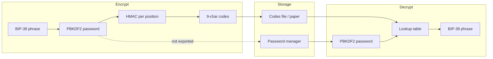

# Security

This page describes what Bip39Chiper actually does cryptographically, what it protects against, and what it does **not** protect against. Read it before storing real funds behind obfuscated codes.

For a full, implementation-independent description of the obfuscation algorithm (suitable for reimplementing in other environments), see **[Algorithm specification](algorithm-spec.md)**.

## Summary

| Property | Value |
|----------|--------|
| Purpose | **Obfuscation** of a BIP-39 mnemonic |
| Network | **None** — fully offline |
| Password in export | **Never** — stored separately by you |
| Code order | **Irrelevant** for decryption |
| Seed validation | BIP-39 checksum verified on decrypt |
| Default iterations | 600,000 PBKDF2-HMAC-SHA256 |
| Default key size | 32 bytes (256 bits) |

> [!WARNING]
> **Not a hardware wallet**
>
> Bip39Chiper helps hide a seed phrase from casual observers when codes and password are kept apart. It does **not** provide tamper-resistant key storage, secure enclave isolation, or protection against a motivated attacker with your codes **and** password. Do not treat it as a replacement for a hardware wallet or audited key-management system.

---

## Threat model

### What it helps with

- Someone finds your written codes but **not** your password — they cannot recover the phrase without brute-forcing PBKDF2 + searching the token space.
- Someone sees an export file — it contains no plaintext words and no password.
- Casual shoulder-surfing — UI blur on background, clipboard auto-clear after copy.

### What it does **not** help with

- Attacker has **both** codes and password — full phrase recovery is straightforward.
- Attacker with malware on your Mac while you enter the phrase or password — keystrokes and memory are exposed.
- Attacker with unlimited offline compute — PBKDF2 slows guessing but does not make weak passwords safe.
- Loss of codes **or** password — there is no recovery mechanism; both are required.

---

## High-level flow



---

## Key derivation

Password → symmetric key via **PBKDF2-HMAC-SHA256** (CommonCrypto / CryptoKit):

| Parameter | Default | Range / notes |
|-----------|---------|---------------|
| Salt | `Bip39Chiper.v1.positional-hasher` | Fixed per format version |
| Iterations | 600,000 | 100,000 – 50,000,000 (UI presets) |
| Output length | 32 bytes | 16, 32, or 64 bytes selectable |
| Min password length | 8 characters | Enforced in app |

```text
key = PBKDF2-HMAC-SHA256(
    password = UTF-8 password,
    salt     = "Bip39Chiper.v1.positional-hasher",
    iterations = N,
    dkLen    = keyBytes
)
```

The salt is **application-specific**, not per-user random. Security relies on password strength and iteration count, not salt secrecy.

---

## Token generation (encrypt)

For each word at **position** `p` (1-based) with **word index** `i` (0–2047 in the BIP-39 English wordlist):

1. Build payload: `"v1:{p}:{i}"` (UTF-8)
2. Compute `HMAC-SHA256(key, payload)`
3. Take the first **5 bytes** of the MAC
4. Encode as a fixed **9-character** string in a custom Base32-like alphabet

### Alphabet

30 characters, radix 30, Crockford-inspired, uppercase only:

```text
23456789ABCDEFGHJKMNPQRSTVWXYZ
```

Excluded to reduce confusion: `0`, `O`, `1`, `I`, `L`, `U`.

Encoding treats the 5-byte prefix as a big-endian integer, reduces modulo 30⁹, and maps digits to alphabet indices. Leading zeros pad with the first alphabet character.

Each `(position, word)` pair maps to exactly one token for a given key. Different positions produce different tokens even for the same word.

---

## Recovery (decrypt)

1. Derive the same key from password + settings
2. **Precompute lookup table**: for every `(position 1…N) × (word index 0…2047)`, generate the token → `(position, word)` mapping
3. For each input code (any order):
   - Normalize: uppercase, strip non-alphabet characters
   - Validate: exactly 9 valid alphabet characters
   - Look up in table; must map to exactly one unfilled slot
4. When all `N` slots are filled, run **BIP-39 checksum** validation on the assembled word list

### Collision handling

Theoretically two different `(position, word)` pairs could produce the same 9-character token (birthday bound on truncated HMAC). The app detects **ambiguous** tokens (multiple matches for the same slot) and **slot conflicts** and reports an error instead of silently picking one.

Wrong password typically yields **token not found** errors during entry because the lookup table does not match the codes.

---

## Export file format

Plain text, UTF-8:

```text
# version: v1
# words: 24
# iterations: 600000
# keyBytes: 32
<whitespace-separated tokens>
```

- Comment lines start with `#` and use `key: value` (case-insensitive keys: `version`, `words`, `iterations`, `keybytes`)
- Token line accepts spaces, commas, or semicolons as separators
- **Password is never included**
- Optional **shuffle on export** randomizes token order in copy/save only; decryption is order-independent

---

## Format version `v1`

| Field | Value |
|-------|--------|
| `versionPrefix` | `v1` |
| `applicationSalt` | `Bip39Chiper.v1.positional-hasher` |
| `tokenLength` | 9 |
| `tokenByteCount` | 5 (from HMAC-SHA256) |

Future versions may change salt, token length, or HMAC payload format. Exports record the version in headers so imports can select the correct parameters.

---

## Comparison to encryption

| | Bip39Chiper (obfuscation) | AES-GCM encryption |
|--|---------------------------|---------------------|
| Output | Deterministic codes per position | Random ciphertext |
| Decrypt without order | Yes — lookup by token | N/A |
| Same password + phrase | Same codes every time | Different ciphertext each time (with random IV) |
| Information leaked | Token space is small (9 chars, 30^9 possibilities per slot) | Ciphertext hides structure |
| Goal | Hide mnemonic | Confidentiality against strong adversaries |

The scheme is intentionally **reversible by design** for anyone with password + codes. It trades cryptographic strength for human-readable codes that can be typed back in any order.

---

## Recommendations

1. Use a **strong, unique password** — the iteration count only helps if the password resists guessing.
2. Keep **codes and password separate** — the security model assumes split storage.
3. Prefer **higher iterations** if decrypt speed on your Mac is acceptable (600k is a reasonable default).
4. Verify recovery periodically with a **test phrase**, not your main wallet seed.
5. For high-value keys, use a **hardware wallet** and treat Bip39Chiper as an optional obfuscation layer only.

---

## Source references

Normative algorithm description: [Algorithm specification](algorithm-spec.md). Conformance vectors: [bip39-chiper-test-vectors](https://github.com/li-nd/bip39-chiper-test-vectors) (Git submodule in this app repo — see [Test vectors](test-vectors.md)).

Reference implementation (macOS app):

- `Bip39Chiper/Core/Crypto/PositionalHasher.swift` — PBKDF2, HMAC, encoding
- `Bip39Chiper/Core/Settings/AppSettings.swift` — `HasherConfig`, defaults
- `Bip39Chiper/Features/Decrypt/DecryptTokenProcessor.swift` — lookup and slot filling
- `Bip39Chiper/Core/Export/ExportService.swift` — export format and shuffle

Unit tests cover token round-trips, import parsing, and decrypt logic.
