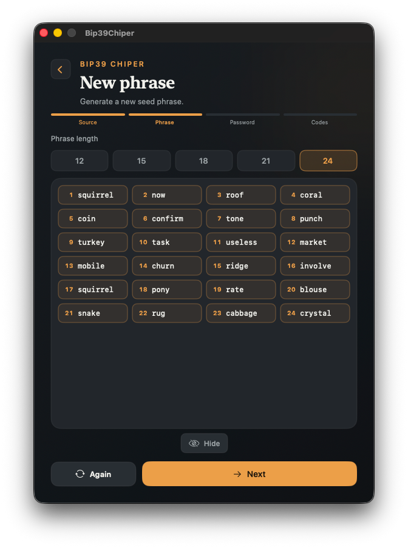
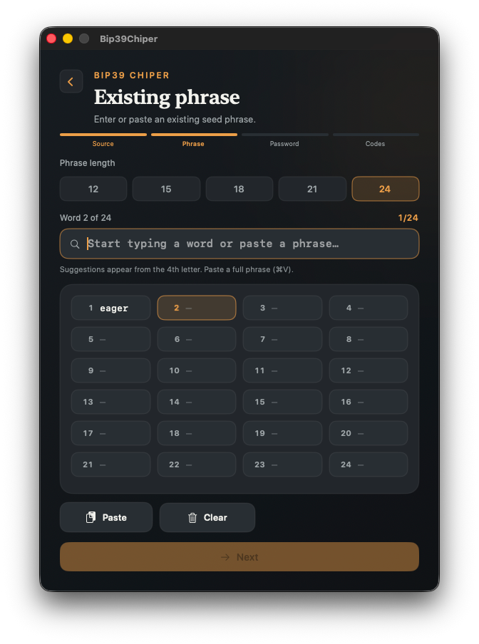
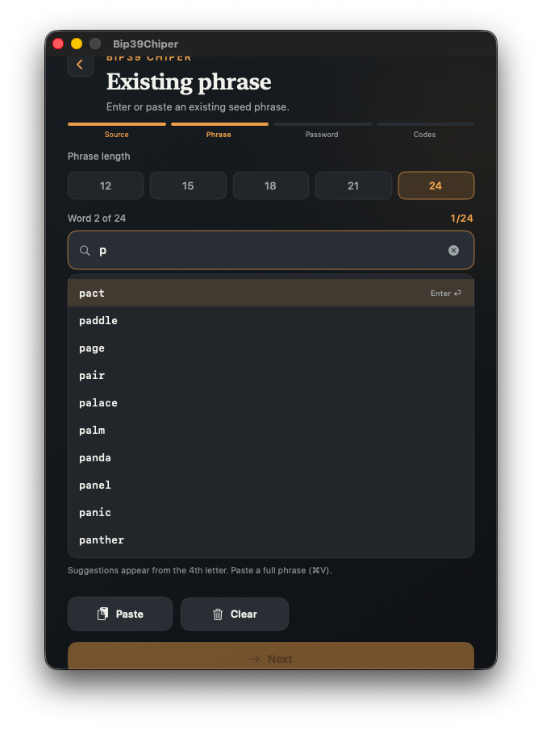
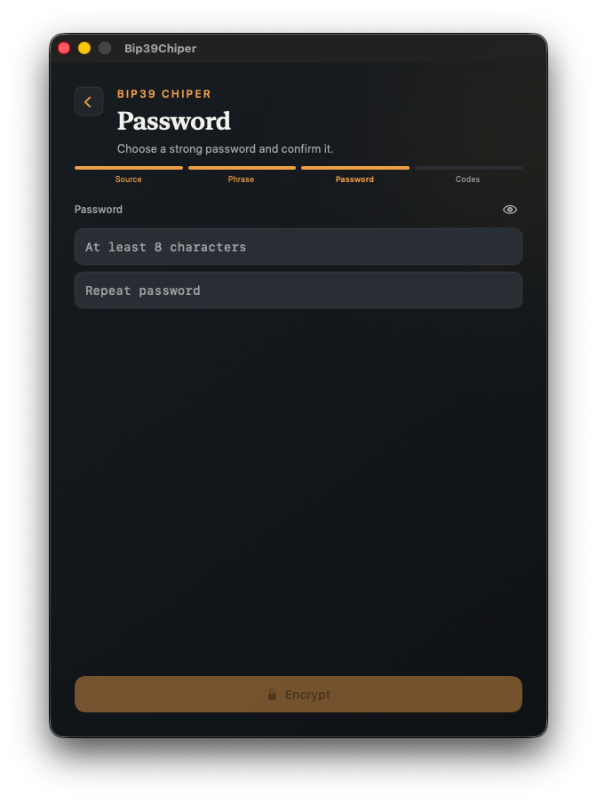
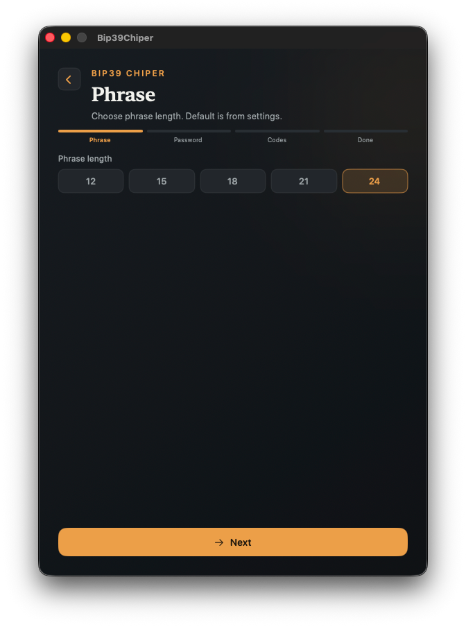
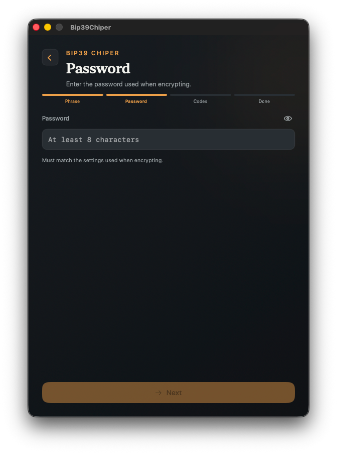
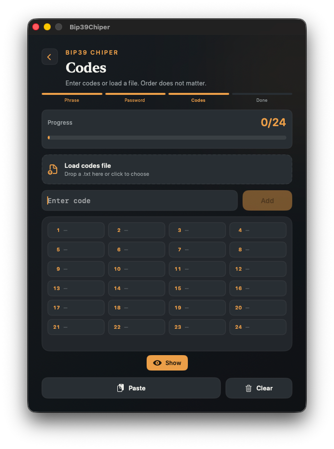

# Usage

Bip39Chiper has two main flows — **Encrypt** (phrase → codes) and **Decrypt** (codes → phrase). Both are step-by-step wizards. Settings affect defaults and crypto parameters; see [Security](security.md) for what those parameters mean.

## Home

The home screen shows your current crypto summary (word count, PBKDF2 iterations, key size) and two entry points.


Keyboard shortcuts (menu **Navigate**):

| Shortcut | Action |
|----------|--------|
| `⌘1` | Home |
| `⌘⇧E` | Encrypt |
| `⌘⇧D` | Decrypt |

---

## Encrypt

### 1. Choose source

Pick how to supply the seed phrase:

- **Create** — generate a new valid BIP-39 phrase
- **Enter** — type or paste an existing phrase
- **Import** — load a `.txt` codes file (starts decrypt flow instead)


### 2. Create a new phrase

If you chose **Create**, Bip39Chiper generates a valid mnemonic for the selected word count (12, 15, 18, 21, or 24 words). Review it, then continue.



### 3. Enter an existing phrase

If you chose **Enter**, type words one at a time with BIP-39 autocomplete, or paste the full phrase. Invalid words are highlighted.





### 4. Set a password

Choose a password (minimum 8 characters). This password is **not** stored in the export file — keep it separately from your codes.



### 5. Result — your codes

After encryption you see all position-dependent codes in order. From here you can:

- **Copy** — clipboard (auto-clears after ~45 seconds if unchanged)
- **To file** — save a `.txt` export
- **Poster** — render a PNG grid for printing
- **Print** — send the poster to the printer
- Toggle **Shuffle on export** — when enabled, copy/save order is randomized (on-screen order stays positional)


### 6. Export formats

**PNG poster** — a printable grid with settings summary in the header:


**`.txt` file** — comment headers with crypto settings, then a whitespace-separated token line:

```text
# version: v1
# words: 24
# iterations: 600000
# keyBytes: 32
2ABC3DEF 4GHJ5KLM ...
```


> [!NOTE]
> **Shuffle vs on-screen order**
>
> Codes on the result screen follow **position order** (word 1 → code 1, etc.). If **Shuffle on export** is on, the order in copied text or saved `.txt` may differ. Decryption ignores order — paste codes in any sequence.

---

## Decrypt

### 1. Phrase length

Select how many words the original phrase had (12–24). This must match the export.



### 2. Password

Enter the same password used during encryption. Wrong password produces no valid matches.



### 3. Enter codes

Paste or type codes. They can be space-, comma-, or newline-separated. Order does not matter — each code maps to exactly one word slot when the password and settings are correct.

You can also **Import** a `.txt` file; if its headers differ from current Settings, the app offers to apply the embedded values.



### 4. Progress

As codes are matched, slots fill in. Invalid format, unknown token, or ambiguous collision stops with a clear error.


### 5. Result

When all slots are filled, Bip39Chiper validates the BIP-39 checksum and shows the recovered phrase.


---

## Settings

Open **Settings** from the home screen gear icon or menu.

### General

- **Language** — 21 locales; overrides system language when set
- **Default word count** — preselects 12/15/18/21/24 in wizards
- **Show onboarding again** — replay the first-run tour


### Encryption

- **Format version** — currently `v1` only
- **PBKDF2 iterations** — presets from 210k to 50M (default 600k)
- **Derived key bytes** — 16, 32, or 64 (default 32)

These values must match between encrypt and decrypt. Exported `.txt` files embed them in `#` comment lines.


---

## Importing a codes file

A valid export looks like:

```text
# version: v1
# words: 24
# iterations: 600000
# keyBytes: 32
TOKEN1 TOKEN2 TOKEN3 ...
```

On import, Bip39Chiper:

1. Parses headers and the token line
2. Compares settings to your current defaults
3. Offers to apply differences before decrypting
4. Pre-fills the codes field and jumps into the decrypt flow

Plain token lists (no headers) also work if you set phrase length and crypto parameters manually in Settings first.

---

## Tips

- Store **codes** and **password** in different places (physical backup, password manager, etc.).
- Higher PBKDF2 iterations slow down brute-force guessing but also slow encrypt/decrypt on older Macs.
- Use **Poster** or **Print** for offline paper backup; the PNG includes the settings line needed for recovery.
- The app blurs sensitive content when it moves to the background.

For the technical scheme behind codes, see [Security](security.md).
